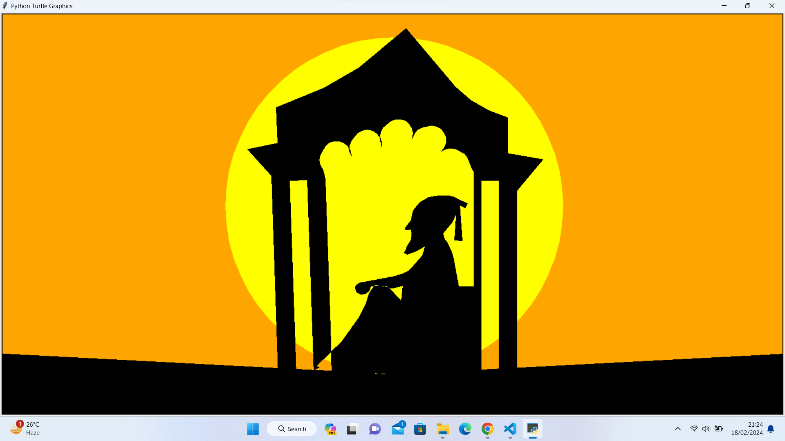

# Shivjayanti Speacial Code - 19 Feb

## Description

This Python script creates a visual animation using turtle graphics while playing background music. The script draws various shapes and patterns using the turtle module and plays a specified MP3 file using the pygame library.

## Requirements

- Python 3.x
- pygame library (install using `pip install pygame`)
- Turtle graphics module (usually included with Python installations)

## Usage

1. Clone the repository to your local machine.
2. Install the required dependencies (`pygame` library).
3. Run the Python script.
4. Enjoy the visual animation and background music!

## Files

- `turtle_music.py`: Python script containing the turtle graphics animation and music playback.
- `12.mp3`: Background music file.

## Output 

